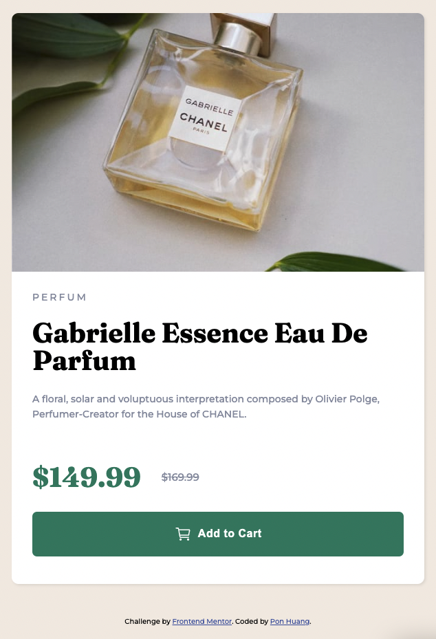

# Frontend Mentor - Product preview card component solution

This is a solution to the [Product preview card component challenge on Frontend Mentor](https://www.frontendmentor.io/challenges/product-preview-card-component-GO7UmttRfa). Frontend Mentor challenges help you improve your coding skills by building realistic projects.

## Table of contents

- [Overview](#overview)
  - [The challenge](#the-challenge)
  - [Screenshot](#screenshot)
  - [Links](#links)
- [My process](#my-process)
  - [Built with](#built-with)
  - [What I learned](#what-i-learned)
  - [Continued development](#continued-development)
  - [Useful resources](#useful-resources)
- [Author](#author)
- [Acknowledgments](#acknowledgments)

**Note: Delete this note and update the table of contents based on what sections you keep.**

## Overview

### The challenge

Users should be able to:

- View the optimal layout depending on their device's screen size
- See hover and focus states for interactive elements

### Screenshot

Desktop version

Hover and active effect

Mobile version

### Links

- Solution URL: (https://github.com/ponhuang/product-preview-card)
- Live Site URL: (https://ponhuang.github.io/product-preview-card/)

## My process

### Built with

- Semantic HTML5 markup
- CSS custom properties
- Flexbox
- CSS Grid
- Desktop-first workflow

### What I learned

According to RWD tips from YouTube, they suggest not using fixed properties. In the beginning I set the size with rem, but when making media query, and it occurs some issues. Therefore, in the media query setup the properties to % and vh, in order to keep the desing better.

### Useful resources

- [5 simple tips to make responsive layout easily](https://www.youtube.com/watch?v=VQraviuwbzU) - This gives me some ideas to make responsive design better.

### Author

Pon Huang
